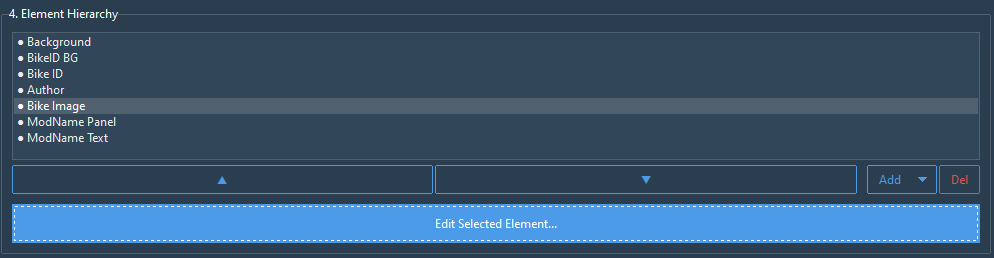

# SMX Sound Creator

A powerful and user-friendly tool designed to streamline the creation of custom sound mods for the game SMX. This application simplifies the entire workflow, from selecting your sound files to packaging a game-ready mod with a fully customized, high-quality preview image.

## Key Features

*   **Intuitive UI:** A clean, modern, and themeable interface built with ttkbootstrap.
*   **Simplified Sound Selection:** Easily select your `engine.wav`, `idle.wav`, `low.wav`, and `high.wav` files, or import them all at once from a single folder.
*   **Live Preview Editor:** What you see is what you get! Design your mod's preview image in a 16:9 canvas. Add, edit, and reorder text and image layers for a professional look.
*   **Advanced Customization:** Fine-tune every element of your preview. Adjust position, scale, rotation, color, fonts, and text outlines.
*   **Global Font Library:** Add your own font folders in the settings to make your favorite `.ttf` and `.otf` fonts available directly within the editor's dropdown menu.
*   **Mod Library Management:** Organize your mods into categories which correspond to folders on your drive.
*   **Multi-Bike Support:** Select which of the standard in-game bikes the sound mod should apply to with a simple click.
*   **Automated Packaging:** The application automatically creates the necessary `.zip` packages and `.png` preview images, placing them in the correct mod library folder, ready to be used in-game.

## Installation

The SMX Sound Creator is a standalone application. No installation is required.

1.  Download the latest release executable (`.exe`).
2.  Place the executable in a folder of your choice.
3.  Run it!

## The Workflow

### Initial Configuration (The Settings Tab)

Before you begin, it's recommended to visit the **Settings** tab to configure your paths. This is a one-time setup.

*   **Mod Libraries:** Add the top-level folders where you store your sound mods (e.g., `...\MX Bikes\mods\sounds\4-Strokes`).
*   **Asset Configuration:** Set the folder path for your bike thumbnail images.

*   **Font Configuration:** Add any folders on your computer that contain `.ttf` or `.otf` font files to make them available in the preview editor.

### Step 1: Sound Files & Output Location

This section covers the core of your mod's content and destination.

1.  **Sound Files:** Use the **Select Folder with Sounds...** button for quick import, or browse for individual `.wav` files. Use the checkboxes to include/exclude specific sounds.
2.  **Output Location:** Choose the **Library** (category), decide if it's a **New Mod** or an **Existing Mod**, and give your package a **Mod Name**.

### Step 2: The Live Preview Editor

This is where you design the promotional image for your mod that will be visible in-game.

#### The Canvas

The Live Preview shows a real-time, 16:9 render of your design. Use the `<` and `>` buttons to cycle the preview through the different bikes you have selected.

#### Element Hierarchy

The Hierarchy lists all the layers in your preview image. You can:
*   **Reorder:** Select an element and use the **▲** and **▼** buttons to move it.
*   **Add/Delete:** Add new Text/Image layers or delete existing ones.

#### The Element Inspector

Select a layer from the hierarchy and click **Edit Selected Element...** to open the Inspector. This window's options will change depending on whether you are editing an image or a text layer.

**Element Inspector for Image**

**Element Inspector for Text**

### Step 3: Bike Selection

In the final panel, click the checkboxes for all the bikes you want this sound mod to apply to.

### Step 4: Create Your Mod!

Once everything is configured, click the **Create Sound Mod Package** button. The application will process your files, generate the images and `.zip` archives, and place them in the correct library folder, ready to be used in the game!

## Putting It All Together

Here is a look at the complete user interface, showing how all the different panels work together to create a seamless workflow from start to finish.

## Here's what you can expect on export
After you click the "Create Sound Mod Package" button, the application will neatly organize all the necessary files into your chosen library folder.
The folder **`ModName`** will be created.

"Library/ModName/"

For each bike you selected, the tool generates two key files:
*   A **`.zip`** file containing the sound files and the internal `preview.jpg`. This is the 'offline preview' file used in-game.
*   A high-quality **`.png`** file, which is a copy of the preview you designed. This can be used as your mod.io thumbnail

## ⚡ Seamless Workflow with SMX Mod Manager

For the ultimate modding experience, the SMX Sound Creator is designed to work in perfect harmony with the **SMX Mod Manager**, a powerful tool for installing and managing all your in-game mods.

By pointing the Sound Creator's output to your Mod Manager's library, you can create, package, and install a new sound mod in just a few clicks.

### The Ultimate 3-Step Workflow:

1.  **Configure:** In the Sound Creator's settings, set your **Mod Library** output to the same folder you use as a `[Sounds]` Library in the SMX Mod Manager.
2.  **Create:** Click the **Create Sound Mod Package** button in this tool to export your mod to that library folder.
3.  **Install:** Switch over to the SMX Mod Manager, hit the **Refresh** button, and your new sound mod will instantly appear, ready to be installed into the game with a single click!

This powerful combination turns creating and testing sound mods into a rapid, seamless process.

[**Get the SMX Mod Manager Here**](https://github.com/kBeQ/SMX-Mod-Manager)

## Technologies Used

*   **Python 3**
*   **Tkinter** for the core GUI framework.
*   **[ttkbootstrap](https://github.com/israel-dryer/ttkbootstrap)** for the beautiful modern themes and widgets.
*   **[Pillow (PIL Fork)](https://python-pillow.org/)** for all image processing and manipulation.

## 📄 License
This project is licensed under the MIT License - see the `LICENSE` file for details.

---

## 🛠️ More SMX Modding Tools

Check out other tools in the SMX Modding suite:

<table width="100%">
 <tr>
  <td align="center" width="50%">
    <h3>SMX Mod Manager</h3>
    
  </td>
  <td align="center" width="50%">
    <h3>SMX Sound Creator</h3>
    
  </td>
 </tr>
</table>